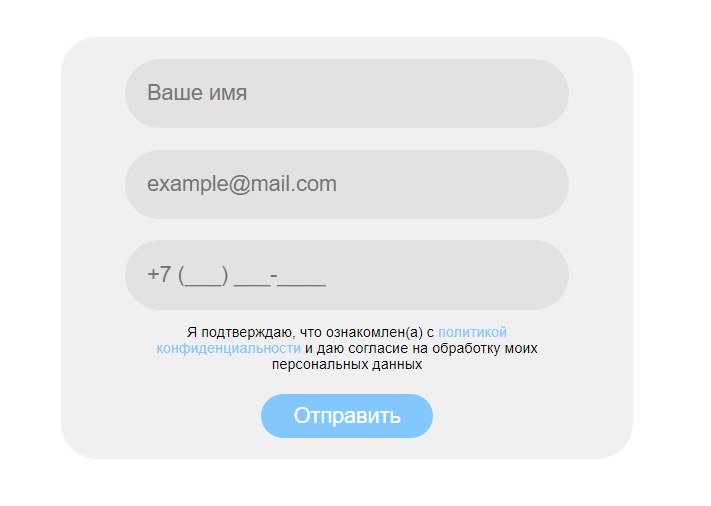
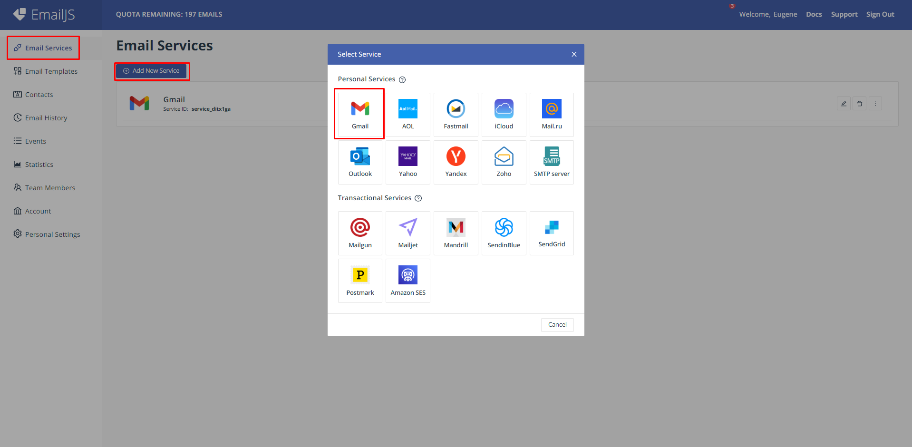
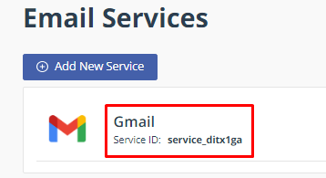
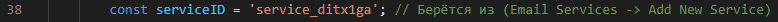
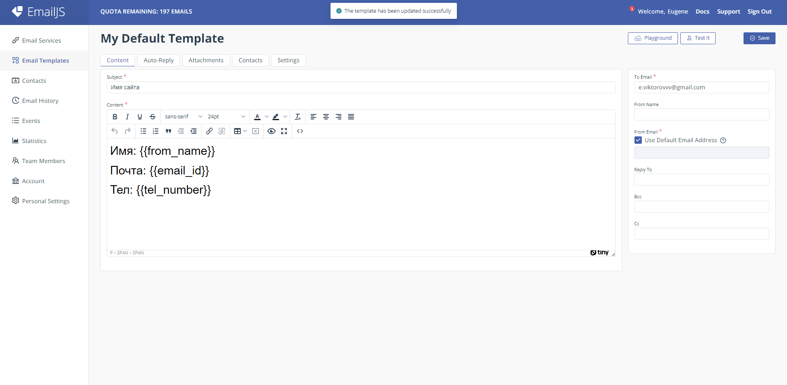
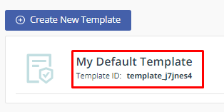
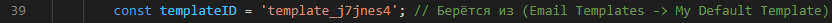
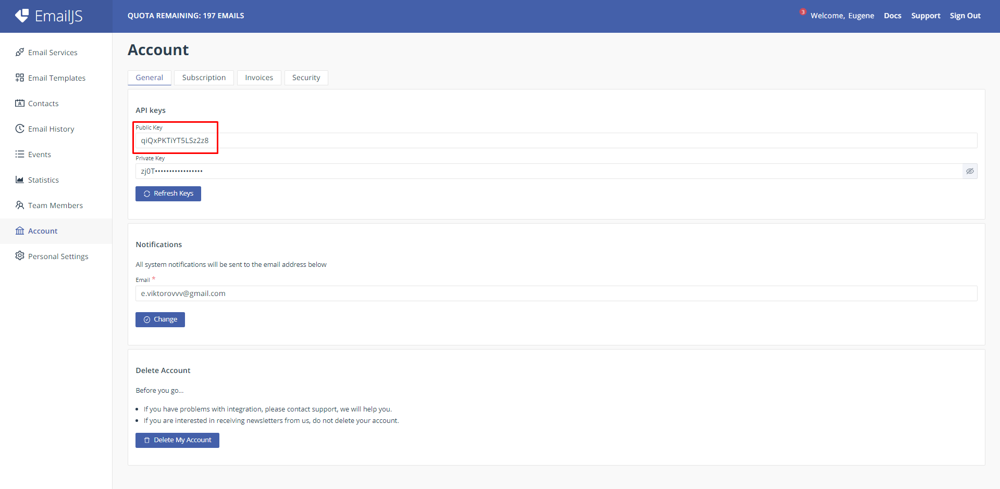
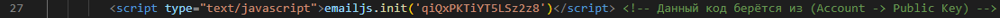
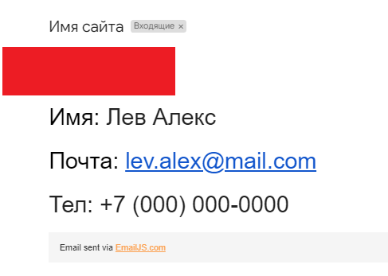

# Форма обратной связи через сервис "EmailJS".
    

## Подключение.
### 1) Регистрация на сервисе <a href="https://dashboard.emailjs.com">"emailj"</a>
   

### 2) После регистрации переходим в пункт "Email Services".  Добавляем удобный для вас сервис. В нашем случае это "Gmail". (Он уже добавлен)
  

### Берём сервисный код
  

### Вставляем его в файл "script.js"
   

### 3) Переходим обратно в браузер. Вкладка "Email Templates". Выбираем "Create New Template" и создаём такую же форму как на скриншоте. UPD: вы можете выделить текст и выбрать размер шрифта и т.п.
  

### Берём сервисный код
  

### Вставляем его в файл "script.js"
   

### 4) И последним кодом станет код аккаунта. Выбираем вкладка "Account" и копируем код "Public Key"
  

### Вставляем его в файл "index.html"
   

### Если всё удачно подключено, то на почту вам будет приходить форма, которую заполнил пользователь.
