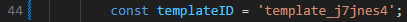

# Feedback form through the "EmailJS" service.
    

## Connection.
### 1. Registration on the service <a href="https://dashboard.emailjs.com/sign-up">"emailj"</a>
   

### 2. After registration, go to the item "Email Services".  Add a service convenient for you. In our case, this is "Gmail". (It's already been added)
  

### We take the service code
  

### Paste it into the "script.js" file
   

### 3. Go back to the browser. Email Templates tab. Select "Create New Template" and create the same form as in the screenshot. UPD: you can highlight text and choose font size etc.
  

### We take the service code
  

### Paste it into the "script.js" file
   

### 4. And the last code will be the account code. Select the tab "Account" and copy the code "Public Key"
  

### Paste it into the "index.html" file
   

### If everything is successfully connected, then the form that the user filled out will come to your mail.
